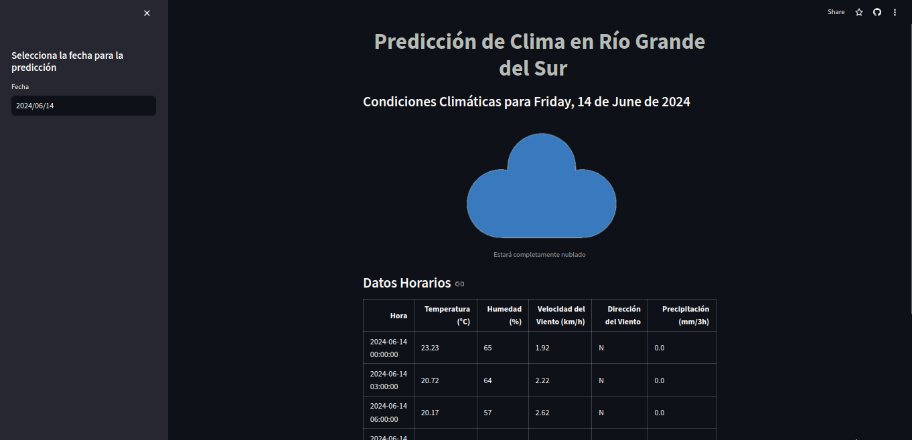

# Predicción de Clima en Río Grande del Sur  

[]

Esta aplicación de Streamlit proporciona predicciones meteorológicas detalladas para el estado de Río Grande del Sur utilizando datos obtenidos de la API de OpenWeather y un modelo de RandomForest entrenado para predecir condiciones climáticas.

## Funcionalidades

1. **Predicción del Clima por Fecha**
   - Los usuarios pueden seleccionar una fecha para ver la predicción del clima.
   - La aplicación muestra una imagen representativa y un mensaje descriptivo según las condiciones meteorológicas previstas.
   - Las condiciones meteorológicas se obtienen de la API de OpenWeather y se presentan en un formato visual atractivo.

2. **Modelo de Predicción con RandomForest**
   - La aplicación utiliza un modelo de RandomForest entrenado con datos históricos para predecir las condiciones climáticas.
   - Las predicciones incluyen probabilidad de lluvia, cantidad de lluvia, temperatura, humedad, y velocidad del viento.

3. **Datos Horarios Detallados**
   - La aplicación muestra datos horarios para la fecha seleccionada, incluyendo temperatura, humedad, velocidad y dirección del viento, y precipitación.
   - Los datos se presentan en una tabla sin el índice para una visualización limpia y organizada.

## Cómo Funciona

1. **Obtención de Datos**
   - La aplicación obtiene datos climáticos de la API de OpenWeather usando una clave API almacenada en los secretos de Streamlit.
   - Los datos incluyen temperatura, humedad, velocidad y dirección del viento, precipitación y condiciones meteorológicas descriptivas.

2. **Modelo de RandomForest**
   - Se entrena un modelo de RandomForest con datos históricos de clima.
   - El modelo se utiliza para hacer predicciones sobre las condiciones climáticas futuras basadas en datos actuales.

3. **Procesamiento de Datos**
   - Los datos se procesan y formatean en un DataFrame de pandas.
   - Se convierten las direcciones del viento de grados a puntos cardinales.

4. **Visualización**
   - La aplicación usa Streamlit para mostrar los resultados.
   - Las imágenes del clima y los datos horarios se centran utilizando columnas de Streamlit para una mejor presentación visual.

   [Visita la WebApp](https://prediccionlluviaenriograndedosul.streamlit.app/)

   

   **Contactame**  
   
